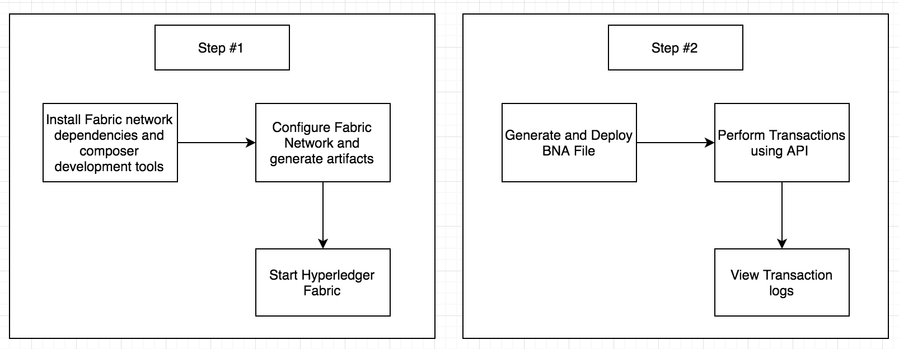
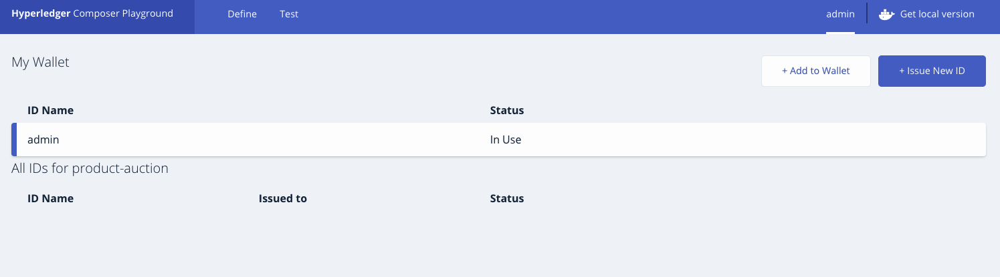
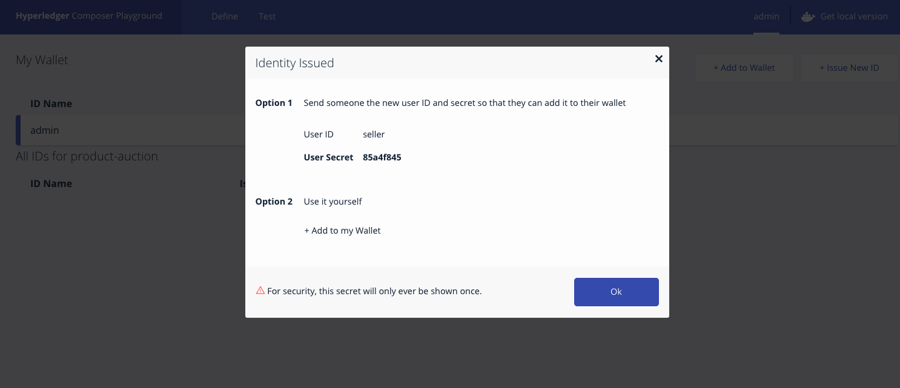
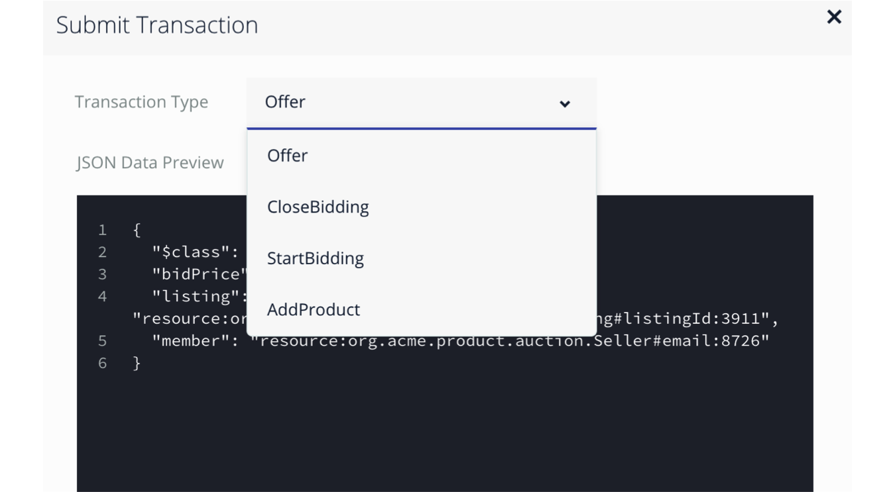

# 하이퍼레저 컴포저 - 상품 경매 네트워크

하이퍼레저 컴포저(Hyperledger Composer) Composite Journey의 Part 2에 오신 것을 환영합니다. 이는 [컴포저 네트워크 설정하기](https://github.com/IBM/BlockchainNetwork-CompositeJourney#build-your-first-hyperledger-network) 시리즈 중 하나입니다. 이 과정은 스마트 계약을 정의하기 위해 컴포저를 사용하는 좀 더 복잡한 내용을 다룹니다. 여러 참가자를 추가하고 블록체인 애플리케이션에 액세스 제어를 추가하는 방법을 배우게 됩니다. 그렇게하기 위해 - 대화형의 분산된 제품 경매 데모 네트워크를 만들 것입니다. 판매할 자산(예비 가격 설정)을 리스트에 넣으면, 경매 종료 후 예비 가격을 설정한 자산이 자동으로 최고 입찰자에게 이전됩니다. 또한 각 참가자는 permissions.acl 파일의 액세스 제어 규칙에 따라 다른 수준의 액세스 권한을 갖습니다. 이 ACL(Access Control List) 파일은 패브릭 컴포저 런타임에 의해 자동 적용되는 공유 및 개인 정보 보호를 위한 설정입니다.  
 
이 비즈니스 네트워크는 다음을 정의합니다:

**참가자:**
`Member` `Seller`

**자산:**
`Product` `ProductListing`

**거래:**
`AddProduct` `StartBidding` `Offer` `CloseBidding`

`addProduct` 함수는  `AddProduct` 트랜잭션이 제출될 때 호출됩니다. 이 로직을 따라 판매자는 제품 자산을 작성하고 레지스트리를 업데이트할 수 있습니다.

`publishListing` 함수는 제품의 소유자가 `StartBidding` 트랜잭션을 제출할 때 호출됩니다. 이 화면에서 판매자는 본인이 판매할 제품과 판매 시작가를 입력하여 스마트 계약을 생성할 수 있습니다.

`Offer` 트렌잭션이 제출되면 `makeOffer` 함수가 호출됩니다. 이 로직은 오퍼 리스트가 아직 판매 중인지를 단순히 확인한 다음, 해당 오퍼를 목록에 추가한 후  `ProductListing` 자산 레지스트리의 오퍼를 업데이트합니다.

`closeBidding` 트랜잭션이 처리를 위해 제출되면 `closeBidding` 함수가 호출됩니다. 이 로직은 해당 리스트가 아직 판매중인지 확인하고 입찰 가격으로 오퍼를 정렬한 다음 준비금이 맞으면, 리스트와 연결된 제품의 소유권을 최고 입찰자에게 이전합니다. 구매자의 계좌에서 판매자의 계좌로 돈이 전송된 후 수정된 모든 자산이 각각의 레지스트리에서 업데이트됩니다.

`models` 디렉토리에있는 `product.cto` 파일은 자산, 참여자 및 트랜잭션에 대한 정의로 구성된 제품 경매 데모에 대한 데이터 모델을 정의합니다. `lib` 디렉토리에 있는 `logic.js` 파일은 `product.cto` 파일에 정의된 트랜잭션을 구현합니다. `.cto` 파일은 자산, 참여자 및 트랜잭션 측면에서 비즈니스 네트워크의 구조를 정의합니다.

`permissions.acl` 파일에 위치한 ACL 규칙으로 비즈니스 네트워크의 도메인 모델의 한 요소를 작성, 읽기, 업데이트 또는 삭제할 수 있는 사용자/역할을 결정합니다. 기본 `System` 사용자에게는 모든 권한이 있습니다. 네트워크 구성원은 모든 리소스에 대한 읽기 권한을 가지며 판매자는 제품을 만들고 제품에 대한 입찰을 시작하고 종료할 수 있습니다. 네트워크 회원은 제품 리스트에 대한 입찰을 할 수 있습니다. 참여자는 허용된 자원 및 트랜잭션에만 액세스할 수 있습니다.

## 구성 요소
* 하이퍼레저 패브릭
* 하이퍼레저 컴포저
* 도커

## 애플리케이션 워크플로우 도표 


여러 참가자 생성 및 ACL 추가
* 추가적인 참가자 추가
* Access Control Lists(엑세스 제어 리스트) 추가
* 체인코드 쿼리 및 호출

## Steps
1. [비즈니스 네트워크 아카이브 (BNA) 생성](#1-비즈니스-네트워크-아카이브-bna-생성)
2. [컴포저 플레이그라운드를 사용하여 비즈니스 네트워크 아카이브 배포](#2-컴포저-플레이그라운드를-사용하여-비즈니스-네트워크-아카이브-배포)
3. [Deploy the Business Network Archive on Hyperledger Composer running locally](#3-deploy-the-business-network-archive-on-hyperledger-composer-running-locally)

## 1. 비즈니스 네트워크 아카이브 (BNA) 생성

파일 구조가 유효한지 확인하려면 비즈니스 네트워크 정의에 대한 BNA (Business Network Archive) 파일을 생성합니다. BNA 파일은 배포 가능한 유닛으로, 실행을 위해 컴포저 런타임에 배포할 수 있습니다.

다음 명령을 사용하여 네트워크 아카이브를 생성합니다:
```bash
npm install
```
다음과 같은 결과가 나옵니다:
```bash
> mkdirp ./dist && composer archive create --sourceType dir --sourceName . -a ./dist/product-auction.bna

Creating Business Network Archive

Looking for package.json of Business Network Definition
	Input directory: /Users/ishan/Documents/git-demo/BlockchainBalanceTransfer-CompositeJourney

Found:
	Description: Sample product auction network
	Name: product-auction
	Identifier: product-auction@0.0.1

Written Business Network Definition Archive file to
	Output file: ./dist/product-auction.bna

Command succeeded
```
`composer archive create` 명령을 사용하면 `dist`폴더 안에 `product-auction.bna` 파일이 생성됩니다.

Node.js 프로세스에서 '블록체인' 인메모리 상태를 저장하는 임베디드 런타임에 대해 비즈니스 네트워크 정의를 테스트할 수 있습니다. 프로젝트 작업 디렉토리에서 test/productAuction.js 파일을 열고 다음 명령을 실행하십시오:
```
npm test
```
다음과 같은 결과가 나옵니다 :
```
> product-auction@0.0.1 test /Users/ishan/Documents/git-demo/BlockchainBalanceTransfer-CompositeJourney
> mocha --recursive

  ProductAuction - AddProduct Test
    #BiddingProcess
      ✓ Add the product to seller list (119ms)
      ✓ Authorized owner should start the bidding (90ms)
      ✓ Members bid for the product (127ms)
      ✓ Close bid for the product (53ms)


  4 passing (2s)
```

## 2. 컴포저 플레이그라운드를 사용하여 비즈니스 네트워크 아카이브 배포

[컴포저 플레이그라운드](http://composer-playground.mybluemix.net/)를 열어서, 기본 샘플 네트워크를 가져옵니다.
이전에 플레이그라운드를 사용한 적이 있다면, 브라우저 콘솔에서 `localStorage.clear()` 을 사용해 브라우저 로컬 저장소를 지우십시오. 이제 `product-auction.bna` 파일을 가져와서 deploy 버튼을 클릭합니다.


**Test** tab**테스트** 탭에서 이 비즈니스 네트워크 정의를 테스트하려면:


`Seller` 참여자 레지스트리에서 새 참여자를 작성하십시오. 맨 왼쪽에 있는 `Seller` 탭을 클릭하십시오.

```
{
  "$class": "org.acme.product.auction.Seller",
  "organisation": "ACME",
  "email": "auction@acme.org",
  "balance": 100,
  "products": []
}
```

`Member` 참여자 레지스트리에서 두 명의 참가자를 만듭니다. 다시 왼쪽 끝에있는 Member 탭을 클릭하십시오.

```
{
  "$class": "org.acme.product.auction.Member",
  "firstName": "Amy",
  "lastName": "Williams",
  "email": "memberA@acme.org",
  "balance": 1000,
  "products": []
}
```

```
{
  "$class": "org.acme.product.auction.Member",
  "firstName": "Billy",
  "lastName": "Thompson",
  "email": "memberB@acme.org",
  "balance": 1000,
  "products": []
}
```

이제 **Access Control**을 추가할 준비가 되었습니다. 먼저 `admin` 탭을 클릭하여 참가자에게 **새로운 ID**를 발급하고 ID를 월렛에 추가하십시오. 아래 이미지와 같이 지침을 따르십시오:

*실제로 월렛에 추가하려면 옵션 2에서 +add to my Wallet을 클릭하십시오.







`Wallet tab`에서 `seller id`를 선택하십시오. `test tab`을 클릭하여 `AddProduct` 및 `StartBidding` 트랜잭션을 수행합니다.


Now click on `Submit Transaction` button and select `AddProduct` transaction from the dropdown, to create a product for the seller.


```
{
  "$class": "org.acme.product.auction.AddProduct",
  "description": "Sample Product",
  "owner": "resource:org.acme.product.auction.Seller#auction@acme.org"
}
```
You can verify the transaction by checking the product and seller registry.

To create a product listing for the above product, copy the `ProductID` from the product registry. Then submit `StartBidding` transaction. Remember to replace `<ProductID>` with the product id you just copied.
```
{
  "$class": "org.acme.product.auction.StartBidding",
  "reservePrice": 50,
  "product": "resource:org.acme.product.auction.Product#<ProductID>"
}
```

You've just listed `Sample Product` for auction, with a reserve price of 50!
A listing has been created in `ProductListing` registry for the product with `FOR_SALE` state.

Now Member participants can submit `Offer` transactions to bid on a product listing.

For each `member id`, select the user id from the `Wallet tab`. To submit an `Offer` transaction select the `test tab` and click on `Submit Transaction` button.
> `ListingID` is the id of the listing copied from the `ProductListing` registry.

```
{
  "$class": "org.acme.product.auction.Offer",
  "bidPrice": 50,
  "listing": "resource:org.acme.product.auction.ProductListing#<ListingID>",
  "member": "resource:org.acme.product.auction.Member#memberA@acme.org"
}
```

```
{
  "$class": "org.acme.product.auction.Offer",
  "bidPrice": 100,
  "listing": "resource:org.acme.product.auction.ProductListing#<ListingID>",
  "member": "resource:org.acme.product.auction.Member#memberB@acme.org"
}
```

You can check the `ProductListing` registry, to view all the bids for the product.


Now again select the `seller id` from the `Wallet tab` tab. Click on `test tab` to end the auction by submitting a `CloseBidding` transaction for the listing.

```
{
  "$class": "org.acme.product.auction.CloseBidding",
  "listing": "resource:org.acme.product.auction.ProductListing#<ListingID>"
}
```

This simply indicates that the auction for `ListingID` is now closed, triggering the `closeBidding` function that was described above.

To check whether the Product is sold you need to click on the `ProductListing` asset registry and check the owner of the product. The highest bid was placed by owner `memberB@acme.org`, so `memberB@acme.org` should be the owner of the product.

You can check the state of the ProductListing with `<ListingID>` is `SOLD`.


Click on the `Member` asset registry to verify the updated balance for buyer and seller. The product is added to the product list of the buyer `memberB@acme.org`.


You can view history of all transactions by selecting the `All transactions` tab.


> You can also use the default `System user` to perform all the actions as we have a rule in `permissions.acl` to permit all access `System user`.

## 3. Deploy the Business Network Archive on Hyperledger Composer running locally

Please start the local Fabric using the [instructions](https://github.com/IBM/BlockchainNetwork-CompositeJourney#2-starting-hyperledger-fabric).
Now change directory to the `dist` folder containing `product-auction.bna` file and type:
```
cd dist
composer runtime install --card PeerAdmin@hlfv1 --businessNetworkName product-auction
composer network start --card PeerAdmin@hlfv1 --networkAdmin admin --networkAdminEnrollSecret adminpw --archiveFile product-auction.bna --file networkadmin.card
composer card import --file networkadmin.card
```

You can verify that the network has been deployed by typing:
```
composer network ping --card admin@product-auction
```

You should see the the output as follows:
```
The connection to the network was successfully tested: product-auction
	version: 0.16.0
	participant: org.hyperledger.composer.system.NetworkAdmin#admin

Command succeeded
```

To create the REST API we need to launch the `composer-rest-server` and tell it how to connect to our deployed business network.
Now launch the server by changing directory to the product-auction folder and type:
```bash
cd ..
composer-rest-server
```

Answer the questions posed at startup. These allow the composer-rest-server to connect to Hyperledger Fabric and configure how the REST API is generated.
* Enter `admin@product-auction` as the card name.
* Select `never use namespaces` when asked whether to use namespaces in the generated API.
* Select `No` when asked whether to secure the generated API.
* Select `Yes` when asked whether to enable event publication.
* Select `No` when asked whether to enable TLS security.

**Test REST API**

If the composer-rest-server started successfully you should see these two lines are output:
```
Web server listening at: http://localhost:3000
Browse your REST API at http://localhost:3000/explorer
```

Open a web browser and navigate to http://localhost:3000/explorer

You should see the LoopBack API Explorer, allowing you to inspect and test the generated REST API. Follow the instructions to test Business Network Definition as mentioned above in the composer section.

## Ready to move to Step 3!
Congratulations - you have completed Step 2 of this Composite Journey - move onto [Step 3](https://github.com/IBM/BlockchainEvents-CompositeJourney).

## Additional Resources
* [Hyperledger Fabric Docs](http://hyperledger-fabric.readthedocs.io/en/latest/)
* [Hyperledger Composer Docs](https://hyperledger.github.io/composer/introduction/introduction.html)

## License
[Apache 2.0](LICENSE)
