# Hyperledger Composer - Product Auction Network

*Read this in other languages: [한국어](README-ko.md),[中国](README-cn.md).*

Welcome to Part 2 of the Hyperledger Composer Composite Journey. This is a continuation of [Composer Network Setup journey](https://github.com/IBM/BlockchainNetwork-CompositeJourney#build-your-first-hyperledger-network).  You should have installed the Hyperledger Composer Devlopment Tools, and Started the Hyperledger Fabric network. This journey introduces more complexity in using Composer to define your smart contract. You will learn how to add multiple participants and add access control to your blockchain application. To do that - you will create an interactive, distributed, product auction demo network. You will list assets for sale (setting a reserve price) and watch as assets that have met their reserve price are automatically transferred to the highest bidder at the end of the auction. Also each participant will have different level of access permissions depending on the Access Control Rules (ACL) in `permissions.acl` file. Access Control Lists (ACL) are the settings for sharing and privacy, which are automatically enforced by the Fabric Composer runtime.  This Pattern has been updated and successfully tested and runs on Hyperledger Composer V0.19.0, Hyperledger Fabric V1.1.


This business network defines:

**Participants:**
`Member` `Seller`

**Assets:**
`Product` `ProductListing`

**Transactions:**
`AddProduct` `StartBidding` `Offer` `CloseBidding`

The `addProduct` function is called when an `AddProduct` transaction is submitted. The logic allows a seller to create a product asset and update its registry.

The `publishListing` function is called when a `StartBidding` transaction is submitted by the owner of product. The logic allows a seller to create a smart contract in the form of product listing for their product with a reserve bid.

The `makeOffer` function is called when an `Offer` transaction is submitted. The logic simply checks that the listing for the offer is still for sale, and then adds the offer to the listing, and then updates the offers in the `ProductListing` asset registry.

The `closeBidding` function is called when a `CloseBidding` transaction is submitted for processing. The logic checks that the listing is still for sale, sort the offers by bid price, and then if the reserve has been met, transfers the ownership of the product associated with the listing to the highest bidder. Money is transferred from the buyer's account to the seller's account, and then all the modified assets are updated in their respective registries.

`product.cto` file present in `models` directory defines a data model for the product auction demo which consists the definition for assets, participants and transactions. `logic.js` file present in `lib` directory implement the transactions defined in the `product.cto` file.  Recall that the `.cto` file defines the structure of your business network in terms of Assets, Participants and Transactions.

ACL rules are present in `permissions.acl` file to determine which user/role is permitted to create, read, update or delete an element in the business network's domain model. The default `System` user has all the permissions. Members of the network have read access to all the resources and the seller can create a product, start and close the bidding for their products. Members of the network can make their bid for the product listing. Participants can access only permitted resources and transactions.

## Included Components
* Hyperledger Fabric
* Hyperledger Composer
* Docker

## Prerequisites
We find that Blockchain can be finicky when it comes to installing Node. We want to share this [StackOverflow response](https://stackoverflow.com/questions/49744276/error-cannot-find-module-api-hyperledger-composer) - because many times the errors you see with Composer are derived in having installed either the wrong Node version or took an approach that is not supported by Composer: 

* [Docker](https://www.docker.com/products/overview) - v1.13 or higher
* [Docker Compose](https://docs.docker.com/compose/overview/) - v1.8 or higher
* [NPM](https://www.npmjs.com/get-npm) - v5.6.0 or higher
* [nvm]() - v8.11.3 (use to download and set what node version you are using)
* [Node.js](https://nodejs.org/en/download/) - node v8.11.3 ** don't install in SUDO mode
* [Git client](https://git-scm.com/downloads) - v 2.9.x or higher
* [Python](https://www.python.org/downloads/) - 2.7.x

## Application Workflow Diagram
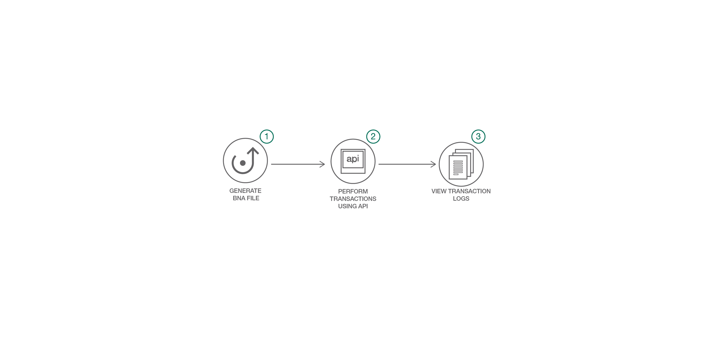

Creating multiple participants and adding ACL
* Adding additional participants
* Adding Access Control Lists
* Querying and invoking the Chaincode

## Steps
1. [Generate the Business Network Archive (BNA)](#1-generate-the-business-network-archive-bna)
2. [Deploy the Business Network Archive using Composer Playground](#2-deploy-the-business-network-archive-using-composer-playground)
3. [Deploy the Business Network Archive on Hyperledger Composer running locally](#3-deploy-the-business-network-archive-on-hyperledger-composer-running-locally)

## 1. Generate the Business Network Archive (BNA)

To check that the structure of the files is valid, you can now generate a Business Network Archive (BNA) file for your business network definition. The BNA file is the deployable unit -- a file that can be deployed to the Composer runtime for execution.

Use the following command to generate the network archive:
```bash
npm install
```
You should see the following output:
```bash
> mkdirp ./dist && composer archive create --sourceType dir --sourceName . -a ./dist/product-auction.bna

Creating Business Network Archive

Looking for package.json of Business Network Definition
	Input directory: /Users/ishan/Documents/git-demo/BlockchainBalanceTransfer-CompositeJourney

Found:
	Description: Sample product auction network
	Name: product-auction
	Identifier: product-auction@0.0.1

Written Business Network Definition Archive file to
	Output file: ./dist/product-auction.bna

Command succeeded
```
The `composer archive create` command has created a file called `product-auction.bna` in the `dist` folder.

You can test the business network definition against the embedded runtime that stores the state of 'the blockchain' in-memory in a Node.js process.
From your project working directory, open the file test/productAuction.js and run the following command:
```
npm test
```
You should see the following output :
```
> product-auction@0.0.1 test /Users/ishan/Documents/git-demo/BlockchainBalanceTransfer-CompositeJourney
> mocha --recursive

  ProductAuction - AddProduct Test
    #BiddingProcess
      ✓ Add the product to seller list (119ms)
      ✓ Authorized owner should start the bidding (90ms)
      ✓ Members bid for the product (127ms)
      ✓ Close bid for the product (53ms)


  4 passing (2s)
```

## 2. Deploy the Business Network Archive using Composer Playground

Open [Composer Playground](http://composer-playground.mybluemix.net/), by default the Basic Sample Network is imported.
If you have previously used Playground, be sure to clear your browser local storage by running `localStorage.clear()` in your browser Console. Now import the `product-auction.bna` file and click on deploy button.

If you don't know how to import, take a [tour of Composer Playground](https://www.youtube.com/watch?time_continue=29&v=JQMh_DQ6wXc)


>You can also setup [Composer Playground locally](https://hyperledger.github.io/composer/latest/installing/development-tools.html).

You will see the following:
<p align="center">
  
</p>


To test this Business Network Definition in the **Test** tab:


In the `Seller` participant registry, create a new participant. Make sure you click on the `Seller` tab on the far left-hand side.

```
{
  "$class": "org.acme.product.auction.Seller",
  "organisation": "ACME",
  "email": "auction@acme.org",
  "balance": 100,
  "products": []
}
```

In the `Member` participant registry, create two participants. Again, click on the `Member` tab on the far left-hand side.

```
{
  "$class": "org.acme.product.auction.Member",
  "firstName": "Amy",
  "lastName": "Williams",
  "email": "memberA@acme.org",
  "balance": 1000,
  "products": []
}
```

```
{
  "$class": "org.acme.product.auction.Member",
  "firstName": "Billy",
  "lastName": "Thompson",
  "email": "memberB@acme.org",
  "balance": 1000,
  "products": []
}
```

Now we are ready to add **Access Control**. Do this by first clicking on the `admin` tab to issue **new ids** to the participants.  Note: the ids are automatically added to the wallet.

Select Admin-> ID Registry
You will see the following:
<p align="center">
  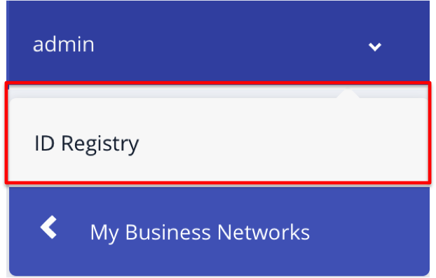
</p>

Please follow the instructions as shown in the images below:

Click on `Issue New ID` button on upper-right hand side - the follow pop-up will appear:

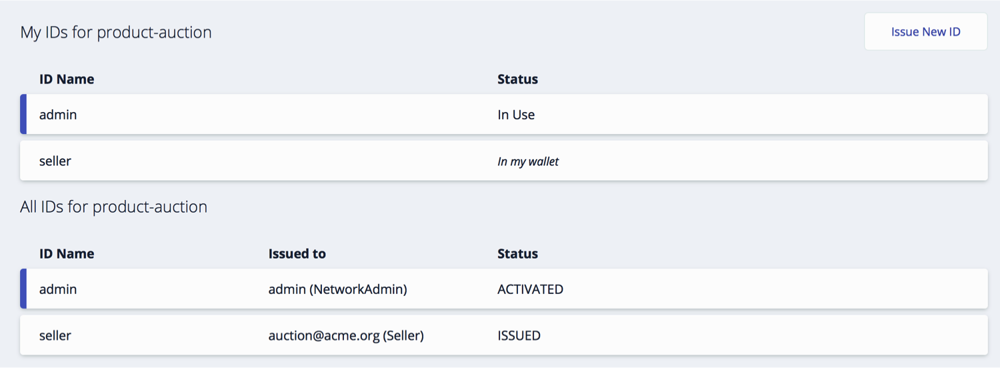

Enter the information you see in the graphic above.

Enter `Seller` for ID Name. Then enter "org.acme.product.auction.Seller#auction@acme.org" in the participant field. **Note**: there is case-sensitivity wrt the name `Seller`. If you have it capitilized as a participant when you added participants under the `Test` page - you must match it here the way you enter it in the Participant field. Ensure you have checked the `Allow this ID to issue new IDs` checkbox. Select the `Create New` button.

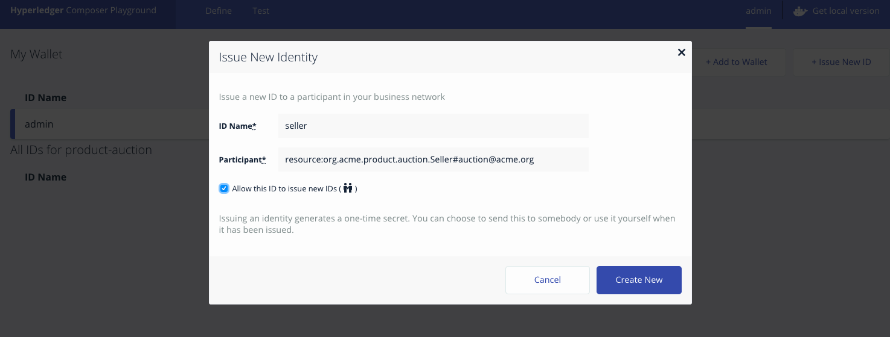

Now issue IDs for MemberA and MemberB (example of issuing ID for MemberA in the graphic below - duplicate process for MemberB). First, again, select `Issue New ID`. Then complete the fields and check the checkbox. Select `Create New`.


Once you complete those steps - your screen should appear as follows:

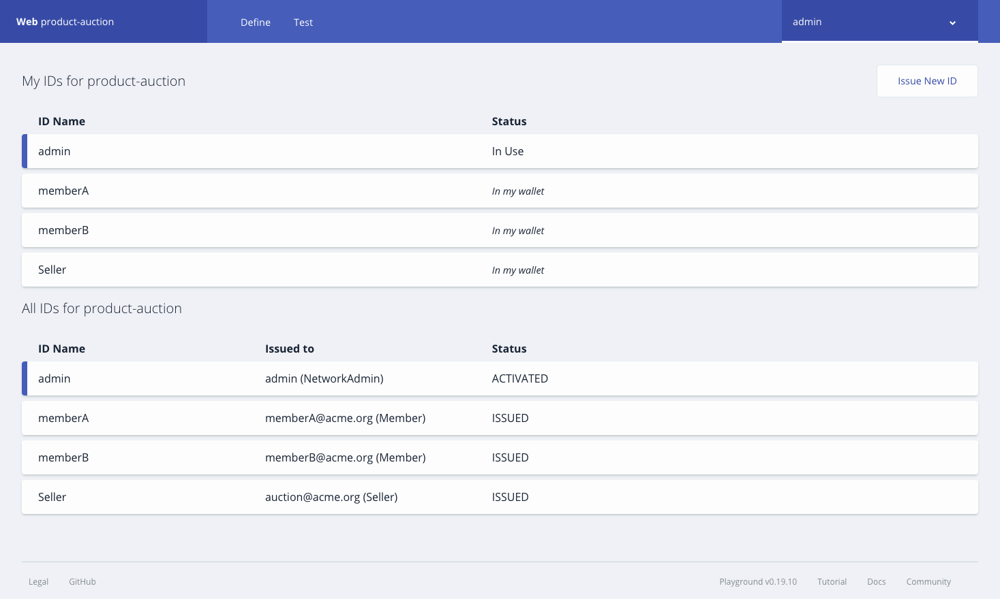

The Wallet tab is pictured in the image below.  Select the `seller id` from `Wallet tab` tab (as demonstrated in the graphic below). Select the 'use now' button. Note the status of the `Seller` id is now `In Use`. Now click on the `test tab` to perform `AddProduct` and `StartBidding` transactions.

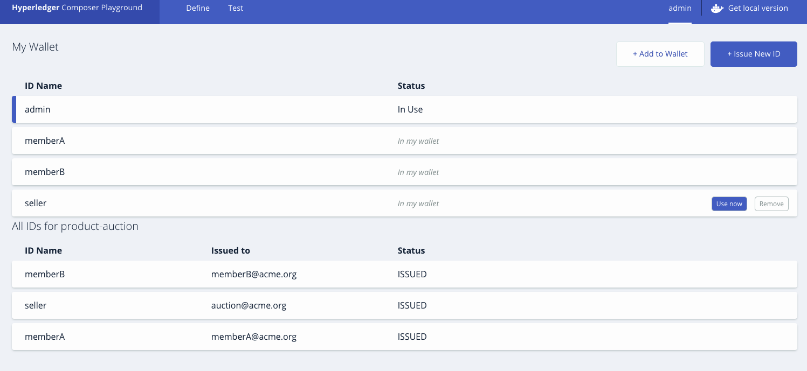

Now click on `Submit Transaction` button and select `AddProduct` transaction from the dropdown, to create a product for the seller.

<p align="center">
  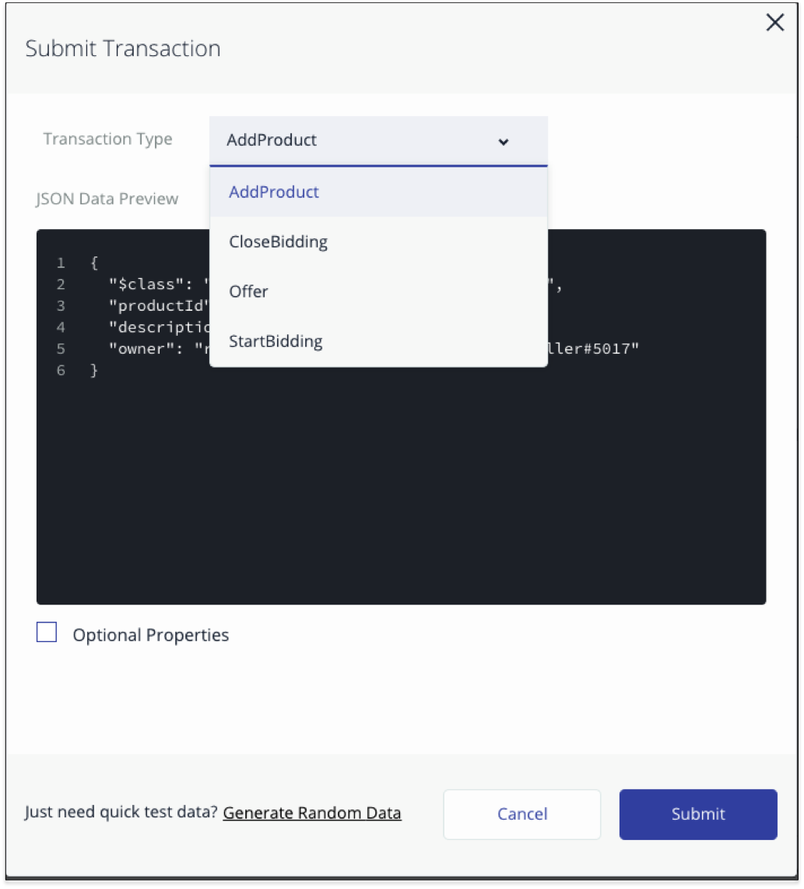
</p>

```
{
  "$class": "org.acme.product.auction.AddProduct",
  "productId": "p1",
  "description": "Sample Product",
  "owner": "resource:org.acme.product.auction.Seller#auction@acme.org"
}
```
You can verify the transaction by checking the product and seller registry.


To create a product listing for the above product, submit `StartBidding` transaction. Again, select `Submit Transaction` button and then select `Start Bidding` transaction from the dropdown.

```
{
  "$class": "org.acme.product.auction.StartBidding",
  "listingId": "l1",
  "reservePrice": 50,
  "product": "resource:org.acme.product.auction.Product#p1"
}
```

You've just listed `Sample Product - P1` for auction, with a reserve price of $50.
A listing has been created in `ProductListing` registry for the product with `FOR_SALE` state.

Now Member participants can submit `Offer` transactions to bid on a product listing.

For each `member id`, select the user id from the tab on the upper right hand-side that probably says `Seller` at the moment. Select MemberA on the left hand side and then `use now` as is demonstrated in the graphic below.

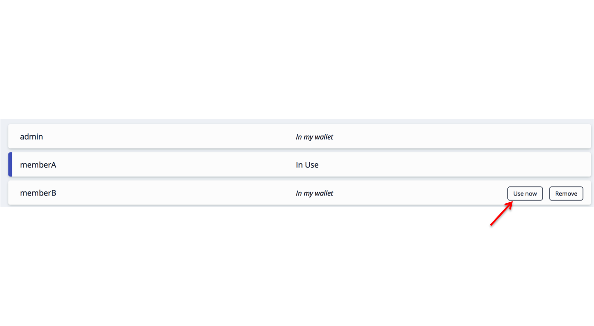


To submit an `Offer` transaction select the `test tab` and click on `Submit Transaction` button. Select `offer` from the drop down.

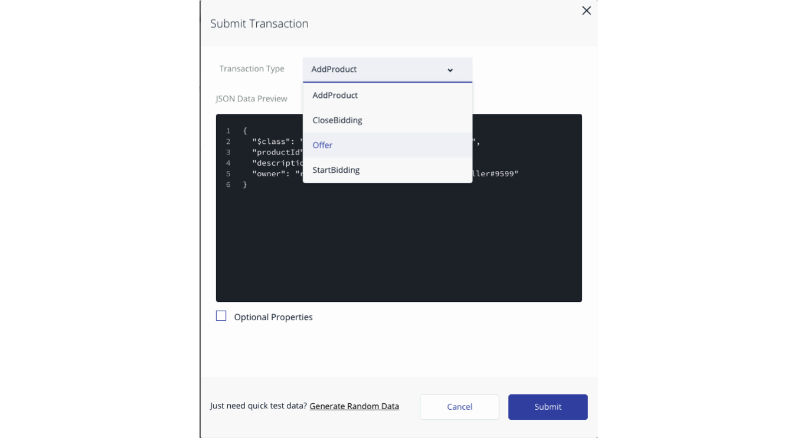

```
{
  "$class": "org.acme.product.auction.Offer",
  "bidPrice": 50,
  "listing": "resource:org.acme.product.auction.ProductListing#l1",
  "member": "resource:org.acme.product.auction.Member#memberA@acme.org"
}
```


Repeat the process for MemberB. Remember to select 'use now' for `memberB` in the registry similar to what you did for `memberA`.

```
{
  "$class": "org.acme.product.auction.Offer",
  "bidPrice": 100,
  "listing": "resource:org.acme.product.auction.ProductListing#l1",
  "member": "resource:org.acme.product.auction.Member#memberB@acme.org"
}
```

You can check the `ProductListing` registry, to view all the bids for the product.

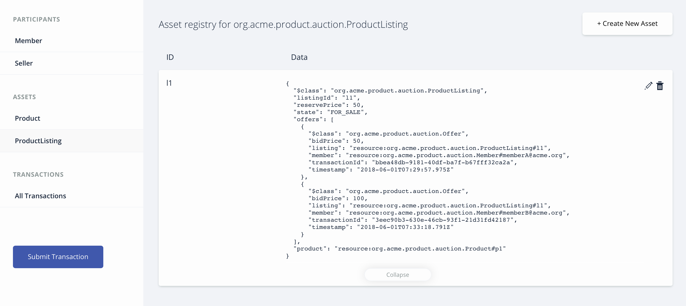

Now again select the `seller id` from the `Wallet tab` tab. Set it to `use now`. Click on `test tab` and then end the auction by submitting a `CloseBidding` transaction for the listing.

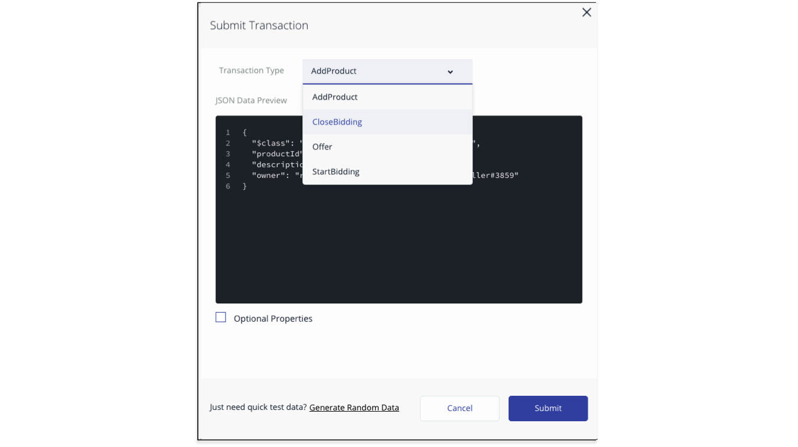

```
{
  "$class": "org.acme.product.auction.CloseBidding",
  "listing": "resource:org.acme.product.auction.ProductListing#l1"
}
```

This simply indicates that the auction for `ListingID` is now closed, triggering the `closeBidding` function that was described above.

To check whether the Product is sold you need to click on the `ProductListing` asset registry and check the owner of the product. The highest bid was placed by owner `memberB@acme.org`, so `memberB@acme.org` should be the owner of the product.

You can check the state of the ProductListing with `l1` is `SOLD`.


Click on the `Member` asset registry to verify the updated balance for buyer and seller. The product is added to the product list of the buyer `memberB@acme.org`. Note the balance of MemberB is $900.

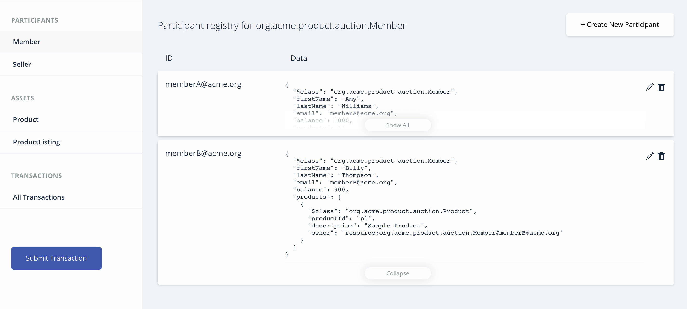

You can view history of all transactions by selecting the `All transactions` tab.

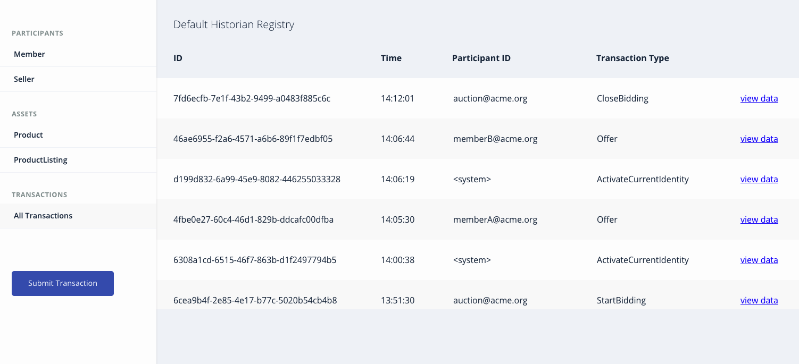

> You can also use the default `System user` to perform all the actions as we have a rule in `permissions.acl` to permit all access `System user`.

## 3. Deploy the Business Network Archive on Hyperledger Composer running locally

Please start the local Fabric using the [instructions](https://github.com/IBM/BlockchainNetwork-CompositeJourney#2-starting-hyperledger-fabric).
Now change directory to the `dist` folder containing `product-auction.bna` file and type:
```
cd dist
composer network install --card PeerAdmin@hlfv1 --archiveFile product-auction.bna

composer network start --networkName product-auction --networkVersion 0.0.1  --networkAdmin admin --networkAdminEnrollSecret adminpw --card PeerAdmin@hlfv1 --file networkadmin.card
composer card import --file networkadmin.card
```

You can verify that the network has been deployed by typing:
```
composer network ping --card admin@product-auction
```

You should see the the output as follows:
```
The connection to the network was successfully tested: product-auction
	version: 0.19.5
	participant: org.hyperledger.composer.system.NetworkAdmin#admin
  identity: org.hyperledger.composer.system.Identity#5b057b5ed98979e814a2c5792f853f03ec2f6cda378058eb4a4dda390cb86dee

Command succeeded
```

To create the REST API we need to launch the `composer-rest-server` and tell it how to connect to our deployed business network.
Now launch the server by changing directory to the product-auction folder and type:
```bash
cd ..
composer-rest-server
```

Answer the questions posed at startup. These allow the composer-rest-server to connect to Hyperledger Fabric and configure how the REST API is generated.
* Enter `admin@product-auction` as the card name.
* Select `never use namespaces` when asked whether to use namespaces in the generated API.
* Select `No` when asked whether to secure the generated API.
* Select `Yes` when asked whether to enable event publication.
* Select `No` when asked whether to enable TLS security.

**Test REST API**

If the composer-rest-server started successfully you should see these two lines are output:
```
Web server listening at: http://localhost:3000
Browse your REST API at http://localhost:3000/explorer
```

Open a web browser and navigate to http://localhost:3000/explorer

You should see the LoopBack API Explorer, allowing you to inspect and test the generated REST API. Follow the instructions to test Business Network Definition as mentioned above in the composer section.

## Ready to move to Step 3!
Congratulations - you have completed Step 2 of this Composite Journey - move onto [Step 3](https://github.com/IBM/BlockchainEvents-CompositeJourney).

## Additional Resources
* [Hyperledger Fabric Docs](http://hyperledger-fabric.readthedocs.io/en/latest/)

## License
[Apache 2.0](LICENSE)
